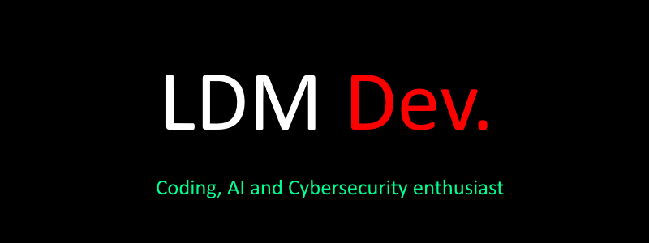

  
  <a href="https://lorydima.github.io/ldmdevwebsite/" style="display: block; text-align: center; margin-top: 10px; font-size: 20px;">LDM Dev Website</a>

# 💻 The codes and frameworks I know

**For Web Development:**
>

**For App Development:**
>

**Others:**
>

# ⚙️ The tools and OS i use

# 📊 GitHub Stats

#

👇 **Check out my featured projects below!** 👇
